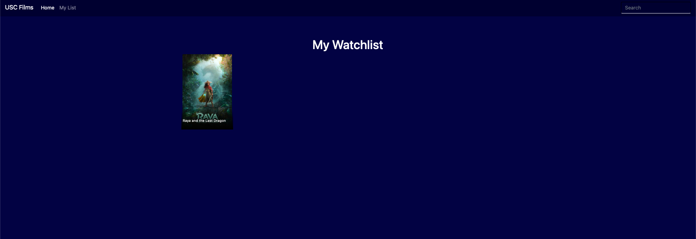
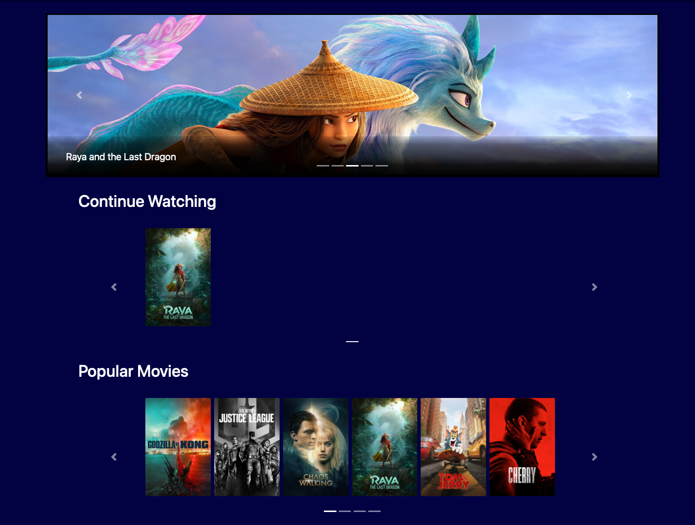

# TMDB Search Engine

##  Overview

In this project, i built a TMDB full stack website for user to search Move and TV Show they want

## HomePage

The Home page of this website

## Carousel for Movie and TV Show

## SearchTab

Search function 

## Detail Section 

Detail for any shows on the website including Casts, Reviews, recommend show and similar show.

## Add to list function 

User can add any show to their list

## Show Cast info

After pressing card of cast, show the details.

## Continue Watching Section

All the views will be memory and show at the homepage

